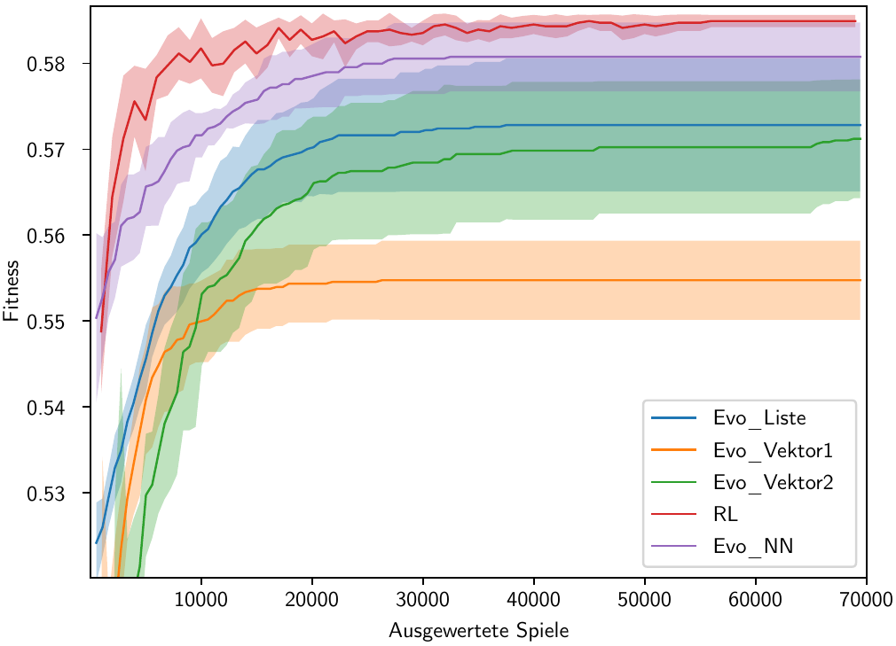

# Vergleich von Strategieoptimierungsalgorithmen für ein Würfelspiel

## Zielstellung
Das Ziel ist es, verschiedene Optimierungsalgorithmen zu vergleichen. Dieses Programm implementiert vier verschiede evolutionäre Algorithmen sowie einen Algorithmus auf Basis von Q-Learing. 
Verschiedene Durchläufe werden in Diagrammen dargestellt.

Beispieldiagramm:

## Dokumentation

Eine vollständige Dokumentation des Quellcodes ist [hier](docs/DOCUMENTATION.md) zu finden.

## Installation
Das Programm lässt sich mit Python ausführen.
Benötigt werden:
  - Python >=3.8
  - [numpy](https://numpy.org/)
  - [tqdm](https://github.com/tqdm/tqdm)
  - [matplotlib](https://matplotlib.org/)

## Fragen und Mithilfe
Das Projekt ist abgeschlossen. Bei Fragen oder ähnlichem bitte an [Samuel](mailto:samuel@LMpost.de) wenden.
